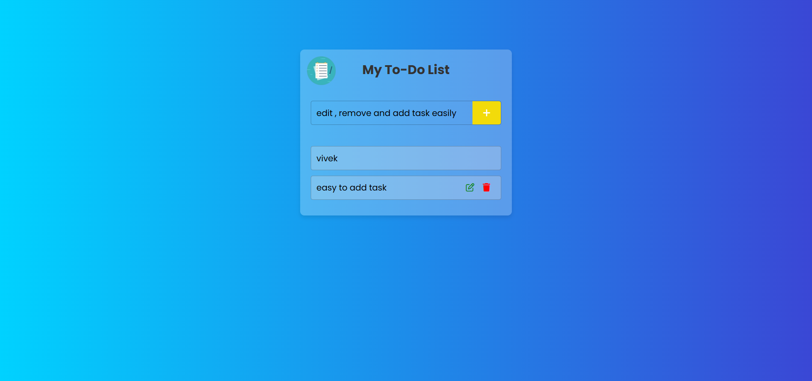

# To-Do App

A simple and interactive To-Do app built using HTML, CSS, and JavaScript. This app allows users to add, mark as complete, and delete tasks easily.

## Features
- Add new tasks
- Mark tasks as completed
- Delete tasks
- Responsive design

## Technologies Used
- **HTML**: Structure of the app
- **CSS**: Styling and layout
- **JavaScript**: Functionality and interactivity

## How to Use
1. Clone this repository:
   ```sh
   git clone https://github.com/yourusername/todo-app.git
   ```
2. Navigate to the project folder:
   ```sh
   cd todo-app
   ```
3. Open `index.html` in a browser.

## Folder Structure
```
.
├── index.html      # Main HTML file
├── style.css       # Stylesheet
├── script.js       # JavaScript file
└── README.md       # Documentation
```

## 📸 Preview



## 🚀 Live Demo

🔗 [Check it out here](https://vivek-todo-app.netlify.app/)

## 📬 Contact

📧 Email: viveks3931@gmail.com  
🔗 [LinkedIn](https://www.linkedin.com/in/vivek3931/) | [GitHub](https://github.com/vivek3931) 

## Future Enhancements
- Add local storage support
- Implement categories and due dates
- Introduce a dark mode theme

## License
This project is licensed under the MIT License.

---
Feel free to contribute by forking and submitting pull requests!

